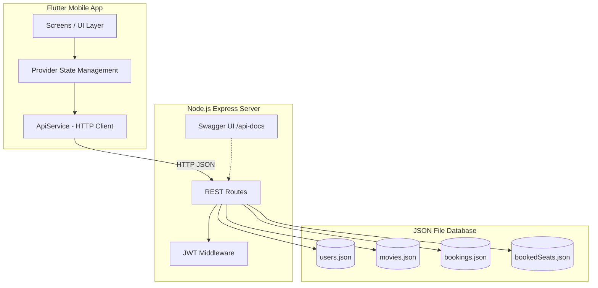
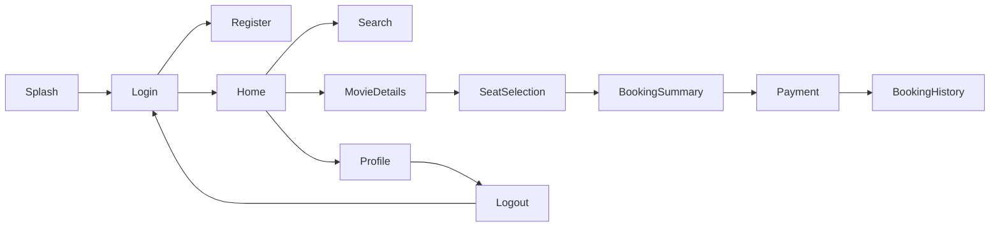

# MovieMate Architecture

## System Overview

## Module Flow

## API Layer

| Layer | Responsibility |
|-------|----------------|
| Routes | HTTP handling, validation, status codes |
| Middleware | JWT token verification |
| Utils/DB | JSON file read/write operations |
| Swagger | API documentation for Postman/testing |

## Frontend Layer

| Layer | Responsibility |
|-------|----------------|
| Screens | UI modules (12 screens) |
| Providers | Auth, Movie, Booking state |
| Services | REST API communication |
| Models | User, Movie, Booking data classes |
| Theme | Material Design 3 cinema theme |
